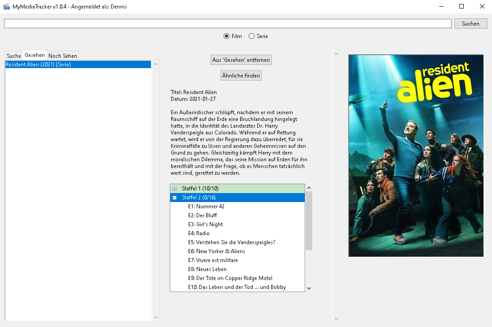

# MyMediaTracker v1.0.4

Eine Desktop-Anwendung zur Verfolgung von Filmen und Serien, die mit Python, Tkinter und der TMDb-API erstellt wurde.


*(**Hinweis:** Ersetze `screenshot.png` durch den Namen eines Screenshots, den du mit ins Repository hochlädst, oder lösche diese Zeile.)*

## Über das Projekt

MyMediaTracker ist eine benutzerfreundliche Desktop-Anwendung für Windows, mit der du deine gesehenen Filme und Serien verfolgen kannst. Dank der Profilverwaltung kann die Anwendung von mehreren Personen im Haushalt genutzt werden, wobei jeder seine eigenen Listen pflegt.

Sie nutzt die TMDb-API, um detaillierte Informationen, Poster und sogar Episodenlisten für Serien abzurufen. Der gesamte Fortschritt wird lokal in einer SQLite-Datenbank gespeichert.

## Funktionen

* **Multi-Profil-Verwaltung:** Erstelle mehrere Benutzerprofile. Jedes Profil hat seine eigenen, separaten Listen.
* **Film- & Seriensuche:** Durchsuche die gesamte The Movie Database (TMDb) nach Filmen oder Serien.
* **Drei-Listen-System:** Verwalte deine Medien in drei separaten Tabs:
    1.  **Suche:** Zeigt Suchergebnisse an.
    2.  **Gesehen (Bibliothek):** Eine Liste aller Medien, die du (auch teilweise) gesehen hast.
    3.  **Noch Sehen (Watchlist):** Eine Liste von Medien, die du in Zukunft sehen möchtest.
* **Detailliertes Episoden-Tracking:**
    * Markiere ganze Staffeln oder einzelne Episoden als gesehen (per Doppelklick).
    * Eine hierarchische Baumansicht (Treeview) lädt Episoden dynamisch nach, wenn eine Staffel aufgeklappt wird.
    * Der Status (komplett, partiell oder ungesehen) wird visuell im Staffel-Namen angezeigt.
* **Kontextsensitive Steuerung:** Die Benutzeroberfläche zeigt nur die Aktionen an, die im aktuellen Tab (Suche, Gesehen, Noch Sehen) sinnvoll sind.
* **Entdecken:** Finde ähnliche Filme oder Serien basierend auf deiner aktuellen Auswahl.
* **Lokale Speicherung:** Alle Profildaten und Listen werden in einer lokalen `media_tracker.db` (SQLite) Datei gespeichert.
* **Kompiliert:** Kann mittels PyInstaller zu einer einzigen `.exe`-Datei für Windows gebündelt werden.

## Verwendete Technologien

* **Python 3:** Kernsprache
* **Tkinter (ttk):** Für die grafische Benutzeroberfläche (GUI)
* **SQLite3:** Für die lokale Datenbank (Profile, Listen, Episodenstatus)
* **Requests:** Für alle API-Anfragen an TMDb
* **Pillow (PIL):** Zum Laden und Anzeigen von Posterbildern
* **PyInstaller:** Zum Erstellen einer eigenständigen `.exe`-Datei für Windows

---

## Installation & Einrichtung

Es gibt zwei Möglichkeiten, die Anwendung zu nutzen:

### 1. Als `.exe` (Windows) verwenden

1.  Lade die `app.exe` aus dem [Releases-Tab](https://github.com/DEIN-USERNAME/DEIN-REPO-NAME/releases) dieses Repos herunter (oder aus dem `dist`-Ordner, falls du selbst buildest).
2.  Lege die `app.exe` in einen eigenen Ordner (z.B. auf deinem Desktop).
3.  Lege die `my_logo.ico`-Datei (aus diesem Repo) in denselben Ordner.
4.  Starte die `app.exe`. Beim ersten Start wird im selben Ordner automatisch die Datenbankdatei `media_tracker.db` erstellt.

### 2. Als Python-Skript ausführen (für Entwickler)

1.  Klone dieses Repository:
    ```bash
    git clone [https://github.com/DEIN-USERNAME/DEIN-REPO-NAME.git](https://github.com/DEIN-USERNAME/DEIN-REPO-NAME.git)
    cd DEIN-REPO-NAME
    ```

2.  Installiere die notwendigen Python-Bibliotheken:
    ```bash
    pip install requests pillow
    ```

3.  **WICHTIG: API-Schlüssel eintragen**
    Diese Anwendung benötigt einen API-Schlüssel von The Movie Database (TMDb).

    * Erstelle ein kostenloses Konto auf [themoviedb.org](https://www.themoviedb.org/).
    * Gehe in deine Account-Einstellungen zum [API-Bereich](https://www.themoviedb.org/settings/api) und beantrage einen "v3"-Schlüssel.
    * Öffne die `app.py`-Datei in einem Texteditor.
    * Finde die Zeile (ca. Zeile 19):
        ```python
        API_KEY = "DEIN_API_SCHLÜSSEL_HIER" 
        ```
    * Ersetze `"DEIN_API_SCHLÜSSEL_HIER"` durch deinen persönlichen TMDb-API-Schlüssel.

    *(**Achtung:** Veröffentliche deinen privaten Schlüssel niemals öffentlich!)*

4.  Starte die Anwendung:
    ```bash
    python app.py
    ```

---

## Build-Anleitung (Erstellung der .exe)

Um die `.exe`-Datei selbst zu erstellen, wird PyInstaller benötigt:

1.  Installiere PyInstaller:
    ```bash
    pip install pyinstaller
    ```

2.  Stelle sicher, dass deine Logo-Datei `my_logo.ico` im selben Ordner wie `app.py` liegt.

3.  Führe den Build-Befehl in deiner Konsole aus (alles in einer Zeile):
    ```bash
    python -m PyInstaller --onefile --windowed --icon=my_logo.ico --add-data "my_logo.ico;." --hidden-import=requests --hidden-import=PIL app.py
    ```

4.  Die fertige `app.exe` befindet sich im neu erstellten `dist`-Ordner.

---

## Lizenz

Dieses Projekt steht unter der MIT-Lizenz.
